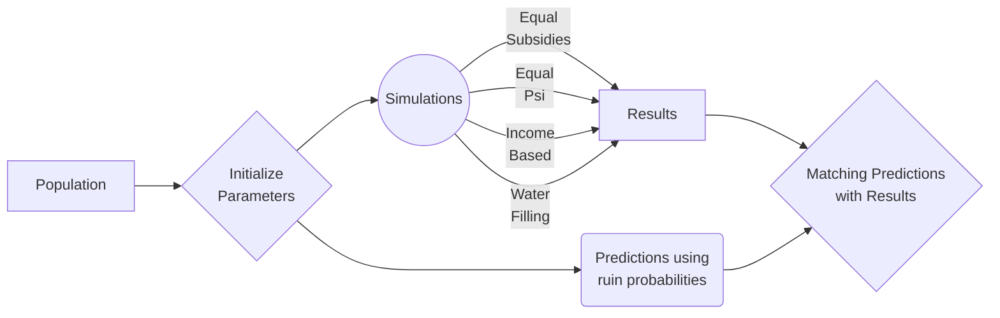

# Subsidy Allocation Algorithm

## Ruin Probability

The probability that the ith family will be ruined at some point of time t in our model is defined by,

$$
\Psi (x_i, c_i, \beta_i, u_i, \mu_i)
$$
where, 
- $x_i$ defines the income subsidy per month
- $c_i$ defines the monthly income of ith family
- $\beta_i$ defines the rate of income shocks per month
- $u_i$ defines the initial reserve value
- $\mu_i$ defines the mean of the shock size distribution F(x)

### Special Case of Zero Initial Reserve

$$
\Psi (x_i, c_i, \beta_i, u_i, \mu_i) = \dfrac{\beta_i \mu_i}{c_i + x_i}
$$

## Control Models

- [ ] Equal Subsidy Allocation
- [ ] Equal Ruin probability reduction
- [ ] Based on income
- [ ] Water Filling Algorithm based on Ruin Probabilities

## Cases

| Case | Name | $x_i$ | $c_i$ | $\beta_i$ | $u_i$ | $\mu_i$ |
| ------ | ------ | ------ | ------ | ------ |------ |------|
| First-World |  |  |  |  |  |  |
| Developing |  |  |  |  |  |  |
| Third World |  |  |  |  |  |  |

### Rough Skeleton of each Case

